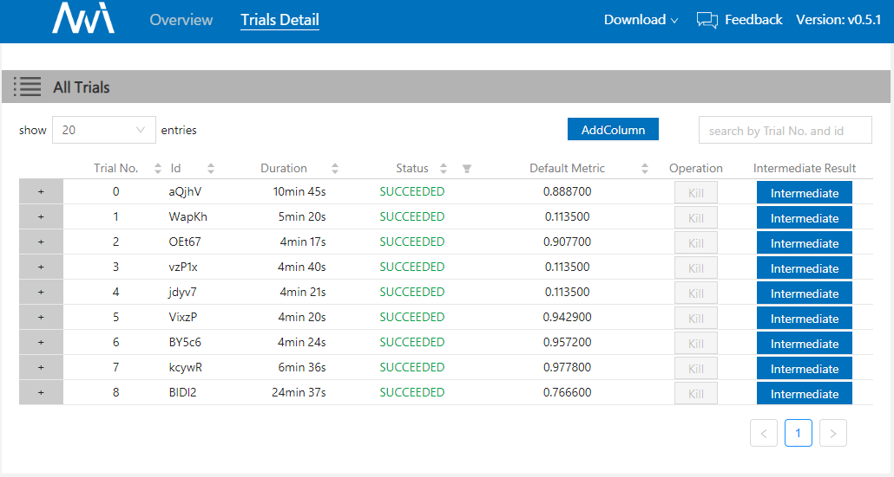

# NNI 安装记录与使用心得

- NNI 项目地址：[https://github.com/Microsoft/nni](https://github.com/Microsoft/nni)
- 运行环境：Windows Subsystem for Linux，python3.6.7

## 安装

1. 通过```pip install nni```命令安装

2. 下载NNI源码```git clone -b v0.5.1 https://github.com/Microsoft/nni.git```

3. 运行mnist示例```nnictl create --config nni/examples/trials/mnist/config.yml```

4. 实验结果 & Web UI

不同Trial的结果按性能排序，点击Trial No.旁的加号可以展开该Trial所使用的一组参数。

点击导航栏的Trials Detail按钮，可以得到实验详情，包括每组超参数的性能、各个超参数对性能的影响、每组参数的运行耗时等。


另外，还可以查看每组参数运行的中间结果，手动终止Trial的运行：



## 代码分析
使用```colordiff nni/examples/trials/mnist/mnist_before.py nni/examples/trials/mnist/mnist.py```命令对比未使用NNI的mnist_before.py和使用nni的mnist.py文件可知，NNI框架对原代码的改动很少，只新增了5行必要代码。


以下是nni训练配置文件，可以配置最大训练时长、最大训练次数、调参算法等等，具有很大的灵活性。

```yaml
#config.yml
authorName: default
experimentName: example_mnist
trialConcurrency: 1
maxExecDuration: 1h
maxTrialNum: 10
#choice: local, remote, pai
trainingServicePlatform: local
searchSpacePath: search_space.json
#choice: true, false
useAnnotation: false
tuner:
  #choice: TPE, Random, Anneal, Evolution, BatchTuner
  #SMAC (SMAC should be installed through nnictl)
  builtinTunerName: TPE
  classArgs:
    #choice: maximize, minimize
    optimize_mode: maximize
trial:
  command: python3 mnist.py
  codeDir: .
  gpuNum: 0
```

以下是search_space.json文件，定义了参数搜索空间。根据以下配置文件可以产生 2 * 4 * 3 * 5 * 4 = 480 种组合！NNI通过内置的参数调优算法，缩小了参数搜索空间，在本次实验中只尝试了9中参数组合就得到了0.97的高分，节约了时间，也省去了人工调参的麻烦。

```json
{
    "dropout_rate":{"_type":"uniform","_value":[0.5, 0.9]},
    "conv_size":{"_type":"choice","_value":[2,3,5,7]},
    "hidden_size":{"_type":"choice","_value":[124, 512, 1024]},
    "batch_size": {"_type":"choice", "_value": [1, 4, 8, 16, 32]},
    "learning_rate":{"_type":"choice","_value":[0.0001, 0.001, 0.01, 0.1]}
}
```

## 与其它自动机器学习工具的比较


## 总结

NNI工具只需一条命令即可安装，原有机器学习代码只需简单的改动即可利用NNI框架自动选择最佳超参数，配置简单灵活，易于上手。希望NNI工具能早日支持Windows系统，日常应用软件只有Windows版，使用NNI却要切换到Linux系统，带来不必要的麻烦。